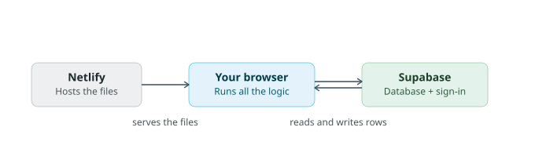
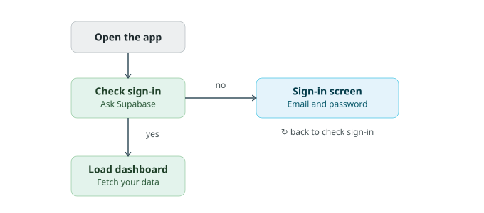
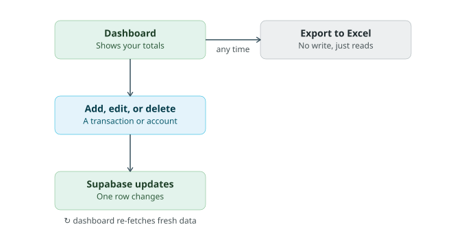

# How Tally Up Works

Three diagrams covering the architecture, the sign-in flow, and the day-to-day loop. Written during `5-build` final review to document the app for submission.

## The three pieces

Netlify just serves static files — it never touches your data. Your browser runs all the logic: computing balances, validating input, building the Excel export. Supabase is the only place real data lives — accounts, transactions, and your sign-in.

## Getting in

Every page load asks Supabase whether you have a signed-in session. No session routes you to the sign-in screen; a valid one loads straight into the dashboard, which fetches your accounts and transactions fresh every time.

## The daily loop

Balances are never stored — they're always `starting_balance + inflows − outflows`, recomputed on load so they can't drift out of sync. Adding, editing, or deleting a transaction or account changes one row in Supabase, and the dashboard re-fetches to reflect it. Exporting to Excel reads the same data but never writes anything back.
